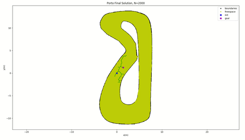
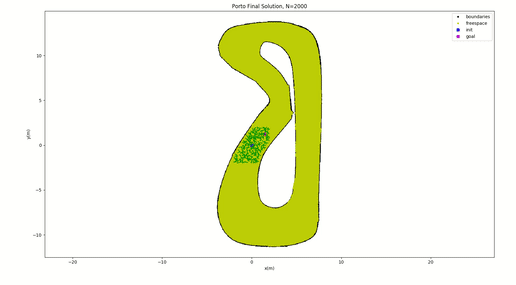
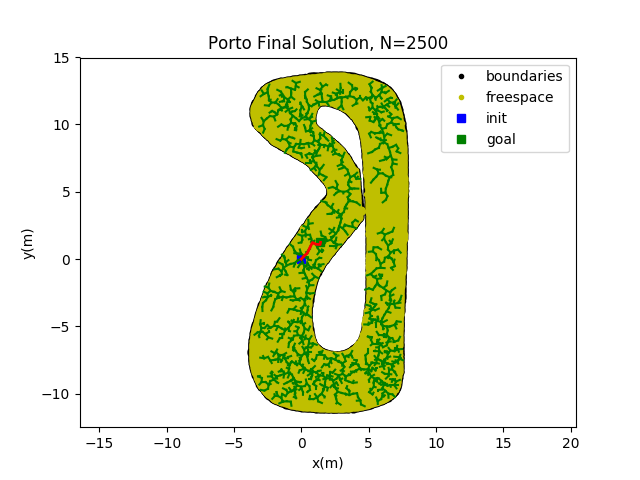
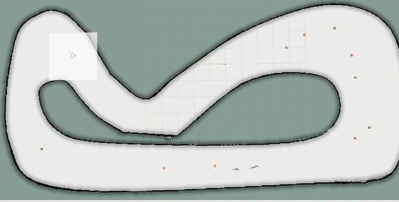
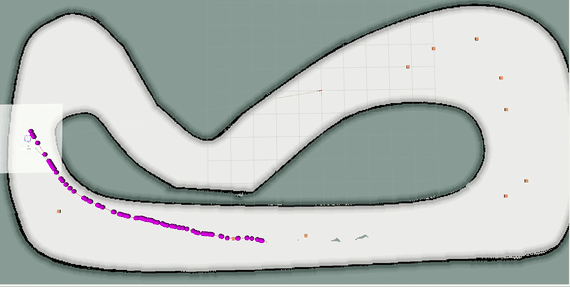
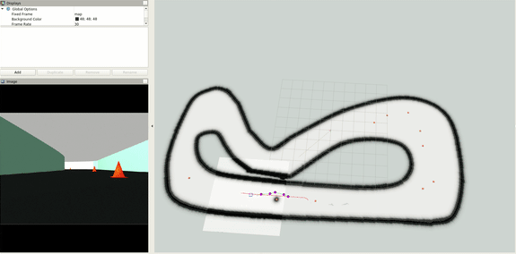

# Planning-and-MPC

Let's see what we can learn about MPC and RRT*. 

This repository assumes that you have this [repo](https://github.com/pmusau17/Platooning-F1Tenth) cloned and built. You can either install it on your host or run it using docker. The dockerfiles and instructions for getting everything setup can be found a the above link. I will try and make sure that everything in this repository can be run through a container. Mostly this reposityory will contain implementations of planning algorithms and model predictive control regimes as I learn them. The idea is to write tutorials as I go (If I haven't done this yet when you arrive please remind me :) ).

# RRT*:


### RRT* with biased sampling near the car


### Closer Look at the "solution" 


### Result after 2500 Samples:


# Rsband Local Planner + Pure Pursuit

The rsband_local_planner combines an elastic band planner, a reeds shepp planner and a fuzzy logic based path tracking controller, to achieve reactive local planning for Car-Like robots with Ackermann or 4-Wheel-Steering. Originally proposed by [George Kouros](https://github.com/gkouros/rsband_local_planner)







# Building the Docker Container

```
$ ./build_docker.sh
```

```
$ ./run_docker.sh
```

In the terminal launched by run_docker.sh, the first thing you will do is build the ros packages.

```
$ source /opt/ros/melodic/setup.bash && catkin_make 
```

and then launch the rsband_local_planner 


Launch the [F1Tenth Simulator](https://github.com/pmusau17/Platooning-F1Tenth): 

If you have the docker image built run the following 


```
$ ./run_docker_simulator.sh
```
In the docker terminal run: 
```
source devel/setup.bash && roslaunch race move_base_planning.launch
```

This should bring up a simulation of a racecar and some cones placed randomly throughout the racetrack. 

In another terminal run:

```
$ ./run_docker.sh
```

In the docker terminal: 

```
$ roslaunch rsband_local_planner move_base_planning.launch
```

This should launch the following rviz window: 



In the above gif, the plans are generated using the rsband local planner proposed by [George Kouros](https://github.com/gkouros/rsband_local_planner) and tracked using a [pure pursuit controller](rsband_local_planner/scripts/pure_pursuit.py). The goals are sent by a node that is a rough implementation of a behaviorial layer. The idea here is that whenever the car gets within a 1 m radius of the goal point we say that the plan has been executed and send the next goal point. The behavioral node implementation node can be found [here](rsband_local_planner/scripts/behavioral_layer.py). The costmaps used throught the planning are updated using the vehicle's lidar sensor and make use of the [move_base](http://wiki.ros.org/move_base) ros package. The configuration files (these were a paaaaaaiiiiin) can be found [here](https://github.com/pmusau17/Planning-and-MPC/tree/main/rsband_local_planner/cfg).
