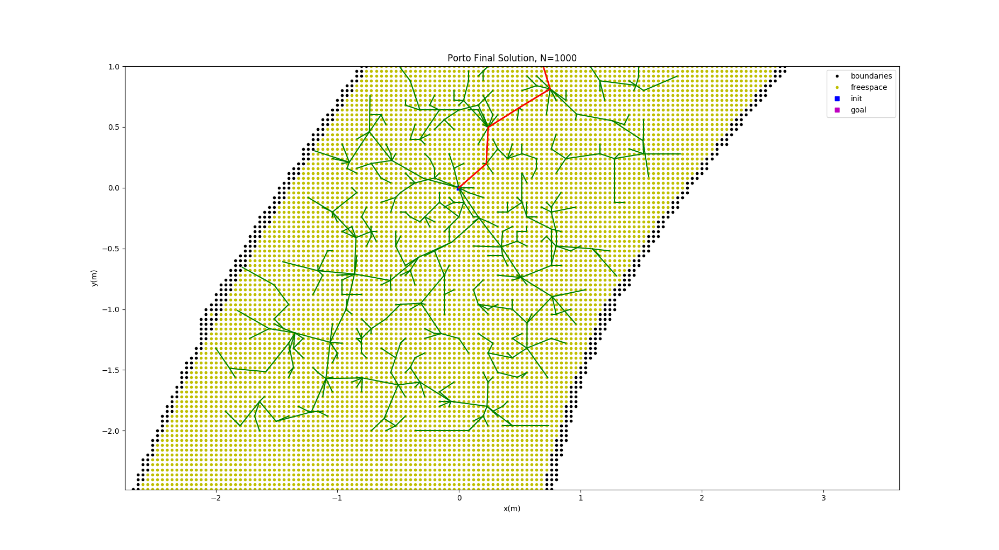

# Planning-and-MPC

Let's see what we can learn about MPC and RRT*. 

This repository assumes that you have this [repo](https://github.com/pmusau17/Platooning-F1Tenth) cloned and built. You can either install it on your host or run it using docker. The dockerfiles and instructions for getting everything setup can be found a the above link. I will try and make sure that everything in this repository can be run through a container. Mostly this reposityory will contain implementations of planning algorithms and model predictive control regimes as I learn them. The idea is to write tutorials as I go. If I haven't done this when you arrive please remind me :).

# RRT*:

Rapidly exploring random trees (RRTs) are a family of algorithms designed to efficiently search high-dimensional spaces by randomly building a space filling tree. The tree is constructed incrementally from samples drawn randomly from the search space and is inherently biased to grow towards large unsearched areas of the configuration space (robot's world). A great introduction to these algorithms can be found in the following [paper](https://people.eecs.berkeley.edu/~pabbeel/cs287-fa19/optreadings/rrtstar.pdf). In this paper, Sertac Karaman et al. proposed a new variant of RRT which had  RRT∗ that has shown to be computationally efficient and possesses probabilistic completeness guarantees. The approach is also asymptotically optimal. What does that mean? An algorithm is said to be complete if it terminates in finite time, returning a valid solution if one exists, and failure otherwise. In this case, it will find a path if one exists, and the asymptotic optimality piece guarantees that eventually (asymptotically) the algorithm will find the shortest path between the start point and goal point that defines the planning problem. If you are like me then this becomes more clear with pictures and an underlying implementation. You can find two different implmentations of the rrt* algorithm in the [rrt_star](rrt_star/) and [rrt_star_ros](rrt_star_ros)  directories. They were inspired (very similar) to the ones contained [here](https://github.com/zhm-real/PathPlanning) where you can find many more implementations of planning algorithms. The [rrt_star](rrt_star/) implementation using an explicit model of obstacles, while the latter [directory]([rrt_star_ros](rrt_star_ros)) does the planning over an occupancy grid. Below are gifs that show planning over the occupancy grid. A lot of the terminology in this space lost me but this [textbook](http://lavalle.pl/planning/) by Steven Lavale was a Godsend.


### RRT* with biased sampling near the car


### Closer Look at the "solution" 


### Result after 2500 Samples:


# Rsband Local Planner + Pure Pursuit

RRT algorithms are great at finding paths within the robot's configuration space. A lot of these approaches assume that two nearby points (or configruations) can be connected by a "straight line". For robots that can turn in place (holonomic robots), this is a valid assumption (ignoring the size of the robot for now). In this case the restrictions are mostly on the set of allowable configurations within the configuration space. However for robots that have wheels (This is us!!), this assumption doesn't quite cut it. Most wheels are are not designed to slide sideways. This imposes constraints on the vehicle referred to as non-holonomic constraints. Interestingly enough this actually a velocity constraint and I'll leave it to Dr. [Lavale](http://lavalle.pl/planning/book.pdf) to explain that (page 370). Essentially however what this means is that we have minimum turning radius and in order for our paths to be feasible we need to take this constraint into account. RRT approaches that handle such constraints typically make some assumptions about the speed and angle of the vehilce as it moves through the configuration space and the most popular variations use a tricylcle model, a simple car, a reeds-shepp car, or a dubins model. The below implementation makes use of a reeds sheep model to generate plans and it was designed for car like robots. The reed sheep curves can be generated by a set of motion primtives (turning left, moving straight, turining right) in the forward and backward directions. A more in depth description can be found [here](http://www.cds.caltech.edu/~murray/courses/me132-sp11/me132b_lec06.pdf).

Anyway enough of that, here is the ROS package. The rsband_local_planner combines an elastic band planner, a reeds shepp planner and a fuzzy logic based path tracking controller, to achieve reactive local planning for Car-Like robots with Ackermann or 4-Wheel-Steering. Originally proposed by [George Kouros](https://github.com/gkouros/rsband_local_planner). Here are two gifs of how this planner works:


# Building the Docker Container For This Repo

```
$ ./build_docker.sh
```

Start the container by running: 

```
$ ./run_docker.sh
```

In the terminal launched by run_docker.sh, the first thing you will do is build the ros packages.

```
$ source /opt/ros/melodic/setup.bash && catkin_make 
```


The next thing to do is Launch the [F1Tenth Simulator](https://github.com/pmusau17/Platooning-F1Tenth): 

If you have the docker image built run the following:


```
$ ./run_docker_simulator.sh
```
Then run: 
```
$ source devel/setup.bash && roslaunch race move_base_planning.launch
```

This should bring up a simulation of a racecar and some cones placed randomly throughout the racetrack. 

In the first docker terminal run:

```
$ roslaunch rsband_local_planner move_base_planning.launch
```

This should launch the following rviz window: 


In the above gif, the plans are generated using the rsband local planner proposed by [George Kouros](https://github.com/gkouros/rsband_local_planner) and tracked using a [pure pursuit controller](rsband_local_planner/scripts/pure_pursuit.py). The goals are sent by a node that is a rough implementation of a behaviorial layer. The idea here is that whenever the car gets within a 1 m radius of the goal point we say that the plan has been executed and send the next goal point. The behavioral node implementation node can be found [here](rsband_local_planner/scripts/behavioral_layer.py). The costmaps used throught the planning are updated using the vehicle's lidar sensor and make use of the [move_base](http://wiki.ros.org/move_base) ros package. The configuration files (these were a paaaaaaiiiiin) can be found [here](https://github.com/pmusau17/Planning-and-MPC/tree/main/rsband_local_planner/cfg).
