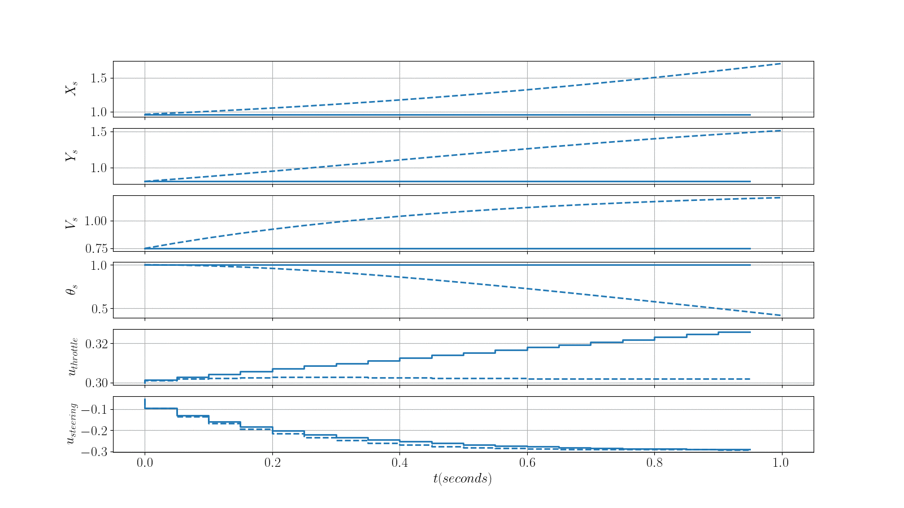

# Do-MPC Playground

This package was used on a linux machine. For the plotting utilities you will need some latex libraries. Install them by running: 

```
$ source setup.sh
```


### Bicycle Model MPC

